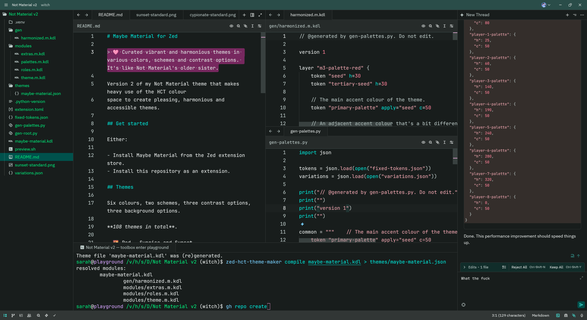

# Maybe Material for Zed

> **🩷 Curated vibrant and harmonious themes in various colors, schemes and contrast options. It's like Not Material's older sister.**  
> 
> Red, yellow, green, blue, purple, cyan. Light and dark, two contrast options, three background options. 72 variations in total.

Version 2 of my Not Material theme that makes heavy use of the HCT colour
space to create pleasing, harmonious and accessible themes.


_**Cypionate.** Pretty, Material-inspired themes._


_**Sunset.** One of six different colours._


_**Honey.** With light and dark, high contrast and low contrast, opaque, transparent or blurred, there's a theme for every palette._

## Get started

Either:

- Install Maybe Material from the Zed extension store.
- Install this repository as an extension.

## Themes

As previously stated, there are:

- Two schemes: light and dark
- Two contrast options: standard and high
- Three background options: opaque, transparent and blurred

And, there are six colours:

- 🌇 Red - Sunrise and Sunset
- 🍯 Yellow - Honey and Amber
- 🌿 Green - Mint and Jade
- 📐 Blue - Workspace and Blueprint
- 🪻 Purple - Lavender and Amethyst
- 🩵 Cyan - Valerate and Cypionate

## For tinkerers

> [!IMPORTANT]
> `zed-hct-theme-maker` hasn't been published yet.

Maybe Material is built on `zed-hct-theme-maker` and some hastily thrown
together Python scripts. So, you'll need Python 3.

- [modules/theme.m.kdl](./modules/theme.m.kdl) and [modules/roles.m.kdl](./modules/roles.m.kdl) contain colour tokens and their mappings to Zed elements
- [fixed-tokens.json](./fixed-tokens.json) contains a set of fixed colours that don't change (i.e "red")
- [variations.json](./variations.json) contains the theme colours and their names.
- [gen-palettes.py](./gen-palettes.py) is the code to generate palettes from [fixed-tokens.json](./fixed-tokens.json) and [variations.json](./variations.json).
- [gen-root.py](./gen-root.py) generates [maybe-material.kdl](./maybe-material.kdl).

After you're done tinkering:

```sh
# I'm using uvx (bundled with uv), because it's easier
# You can also `pip install zed-hct-theme-maker` and omit `uvx`
uvx zed-hct-theme-maker compile maybe-material.kdl > themes/maybe-material.json
```
